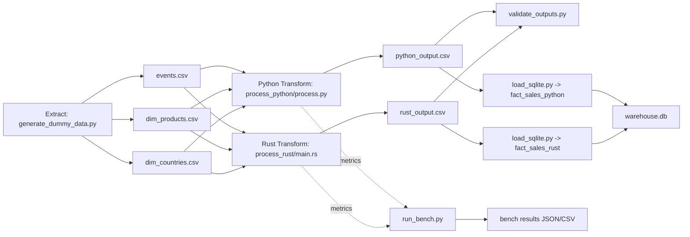
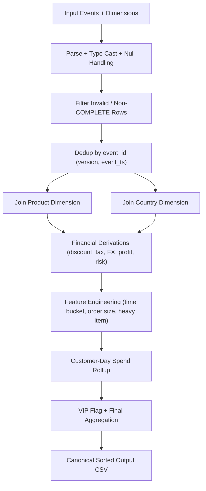

# ETL Performance Benchmark: Rust vs Python

This repository benchmarks a **typical ETL transform stage** where:

- Extract is shared (`pipeline/extract/generate_dummy_data.py`)
- Load is shared (`pipeline/load/load_sqlite.py`)
- Only transform differs:
  - Python (`process_python/process.py`)
  - Rust (`process_rust/src/main.rs`)

## Pipeline shape

1. Generate deterministic dummy raw + dimension data
2. Run transform in Python and Rust with identical logic
3. Validate outputs are byte-for-byte identical
4. Load each output into SQLite tables
5. Save benchmark metrics in `bench/results/`



## Transform logic (identical in both implementations)

- Parse and type-cast rows with null/error handling
- Filter rows (`status == COMPLETE`, positive amount/quantity, valid keys)
- Deduplicate by `event_id` (keep highest `event_version`, then latest `event_ts`)
- Join with product dimension (`product_id -> category, margin_bps, weight_grams`)
- Join with country dimension (`country -> fx_to_usd_ppm, risk_bps, tax_bps`)
- Derive multi-step metrics (discount, tax, USD conversion, profit, risk-adjusted revenue)
- Derive bucketed features (`time_bucket`, `order_size_bucket`, heavy item flag)
- Compute customer-day spend and VIP order flag
- Aggregate by `event_date`, `customer_tier`, `category`, `country`, `time_bucket`, `order_size_bucket`



## Quick start

```bash
make compare
```

Optional tuning:

```bash
make compare ROWS=1000000 RUNS=7 SEED=42
```

## Output artifacts

- Raw data: `data/raw/events.csv`, `data/raw/dim_products.csv`, `data/raw/dim_countries.csv`
- Processed outputs:
  - `data/processed/python_output.csv`
  - `data/processed/rust_output.csv`
- SQLite load target: `data/load/warehouse.db`
- Benchmark results: `bench/results/bench_<timestamp>.json` and `.csv`

## Notes for fair comparison

- Rust compile time is excluded from timed runs (pre-built in release mode)
- Python and Rust runs alternate order per iteration to reduce cache/order bias
- Validation step enforces identical final output
- Benchmark report now includes CPU and RAM metrics per run:
  - `cpu_util_pct`
  - `peak_rss_kb`, `peak_rss_mb`
